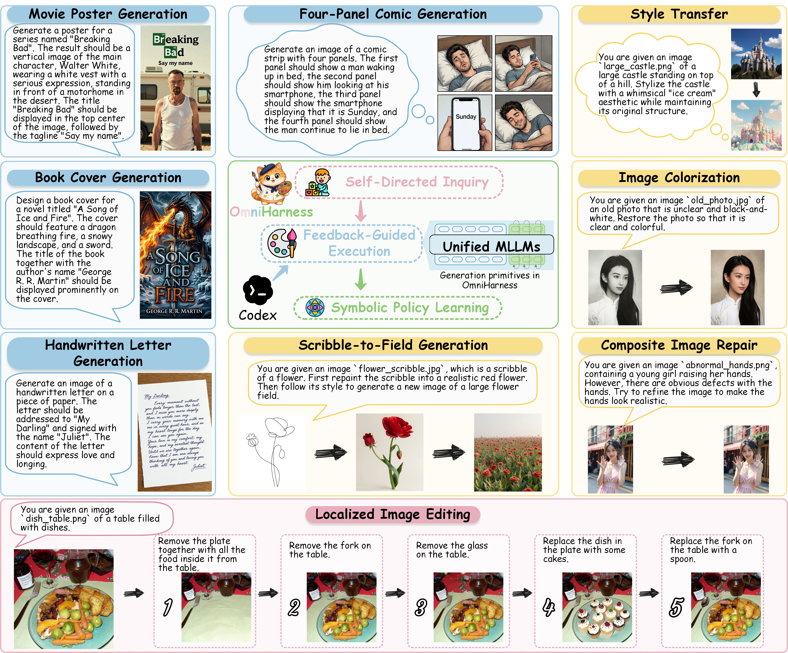
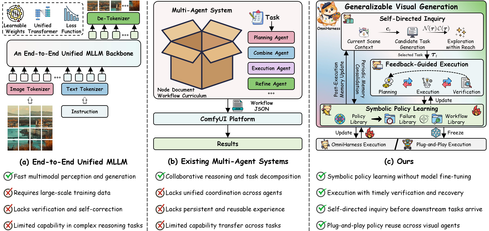
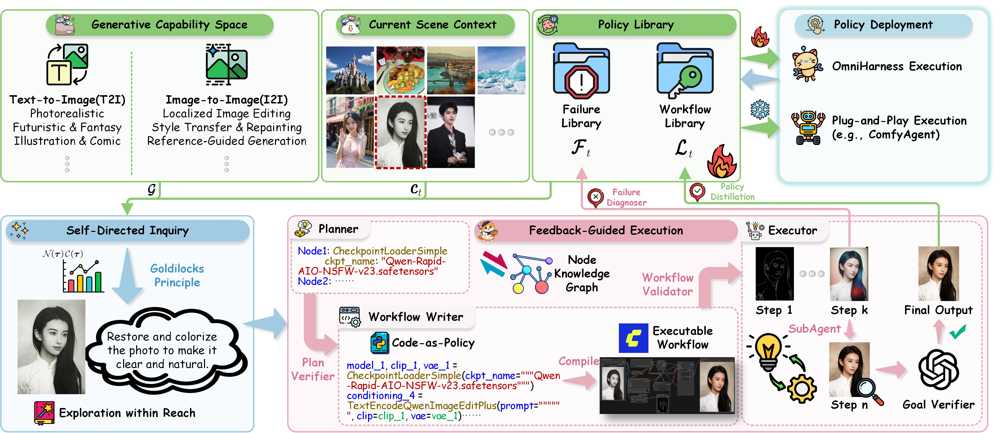

# OmniHarness

**Harnessing Generalizable Visual Generation via Symbolic Policy Learning**

OmniHarness enables generalizable visual generation through symbolic policy learning, feedback-guided execution, and self-directed inquiry. The harness coordinates visual agents using a Codex reasoning backend and ComfyUI. Execution feedback refines the policy library while model parameters remain fixed.

<p align="center">
  
</p>

## Method

<p align="center">
  
</p>

1. **Symbolic Policy Learning.** Distill verified executions into symbolic policies for visual generation task families. Policies encode shared procedures and applicability conditions while removing instance-specific inputs. Execution feedback updates the Workflow Library \(\mathcal{L}_t\) and Failure Library \(\mathcal{F}_t\), which together form the policy library state \(\mathcal{S}_t=(\mathcal{L}_t,\mathcal{F}_t)\).
2. **Feedback-Guided Execution.** Instantiate, adapt, and compose applicable policies, or construct a workflow from the ComfyUI node knowledge graph \(\mathcal{K}\). Compile a restricted Python-like Code-as-Policy program into a ComfyUI graph. Intermediate verification guides workflow refinement and localized recovery while preserving verified steps. Generated Python is not executed directly.
3. **Self-Directed Inquiry.** Motivated by Chinese philosopher Wang Yangming's interpretation of _the investigation of things and the extension of knowledge_, OmniHarness proposes practice tasks before downstream objectives are specified, using the generative capability space \(\mathcal{G}\), scene context \(c_t\), and policy library state \(\mathcal{S}_t\). Exploration within Reach selects the task maximizing capability novelty \(\mathcal{N}(\tau)\) times the competence frontier score \(\mathcal{C}(\tau)=4\bar{r}_t(\tau)(1-\bar{r}_t(\tau))\). Novelty favors underexplored context-capability pairs. Estimated competence follows the weakest required capability, using the highest lower 95% Wilson bound among applicable, non-suspended workflows for each capability. The score favors intermediate estimated competence.

<p align="center">
  
</p>

A symbolic policy in the Workflow Library is represented by a workflow template, applicability metadata, and reliability evidence. Deterministic abstraction replaces prompt, source-media, seed, and output-name inputs with binding roles while retaining graph structure, model choices, and other execution parameters. The writer must bind these roles for each task; compilation and validation reject unbound placeholders. This separates reusable procedures from the inputs of an individual task.

The Workflow Library \(\mathcal{L}_t\) stores workflow templates, preconditions, expected effects, dependencies, and usage statistics. The Failure Library \(\mathcal{F}_t\) stores failure evidence and corrective strategies. The reference policy library is stored in `resources/symbolic_policy`, with `workflow_metadata.json` and `failure_metadata.json` holding the two libraries' records. Invocation counts attribute submitted attempts to plan-selected policies; success counts use task-level verification rather than independent component success measurements.

## Setup

Actual execution requires CPython 3.10.x, Codex access to a Responses-compatible reasoning endpoint, and a running ComfyUI instance with the required nodes and generation models. `requirements.txt` covers the runtime and legacy evaluators; GenEval2 uses the separate environment described in [Evaluation Environments](BENCHMARKS.md#evaluation-environments).

```bash
python -m venv .venv
source .venv/bin/activate
python -m pip install -r requirements.txt
cp config.example.yaml config.yaml
```

On Windows PowerShell, activate with `.venv\Scripts\Activate.ps1` and create the local configuration with `Copy-Item config.example.yaml config.yaml`.

Set the reasoning provider and ComfyUI address in `config.yaml`:

```yaml
codex:
  model: gpt-4o
  provider: omniharness_gpt4o
  base_url: https://YOUR_PROVIDER.example/v1
  api_key_env: OMNIHARNESS_API_KEY
  reasoning_effort: null

runtime:
  comfyui_url: http://127.0.0.1:8188
```

Use an API root such as `/v1`, rather than the `/responses` route. Store the credential in the named environment variable:

```bash
export OMNIHARNESS_API_KEY="YOUR_API_KEY"
```

```powershell
$env:OMNIHARNESS_API_KEY = "YOUR_API_KEY"
```

`--codex-model` selects the model used by the Codex backend. Keep credentials and `config.yaml` outside version control.

## Self-Directed Inquiry and Downstream Execution

Run commands from the repository root. Preflight checks the configured dependencies, resources, credentials, and ComfyUI connection:

```bash
python scripts/run_omniharness.py --config config.yaml --preflight-only inquiry
```

Start self-directed inquiry:

```bash
python scripts/run_omniharness.py --config config.yaml inquiry \
  --iterations 50 \
  --candidate-count 10 \
  --memory-mode online \
  --max-retries 4
```

The default library path is `runs/policy_library`. A new path starts with empty workflow and failure libraries; an existing state is preserved. Use `--symbolic-policy` with a separate path for an independent run. Four retries allow at most five attempts, including the initial attempt; the compatible `--max-attempts` option specifies the total count instead.

The default source pool is `resources/source_image_pool_comfybench`. Use `--source-image-pool resources/source_image_pool_gpt` for the independently generated image pool. The full inquiry capability space supports T2I and I2I; downstream contracts can additionally specify video tasks. For GenEval, GenEval2, and WISE, use `inquiry --modality T2I` with a new library to restrict inquiry to a general T2I capability space, without loading source images or benchmark evaluation tasks. For I2I inquiry, downstream instructions, target outputs, reference workflows, annotations, and evaluation labels are withheld.

Execute a downstream task contract:

```bash
python scripts/run_omniharness.py --config config.yaml execute \
  --task-contract path/to/task_contract.json \
  --memory-mode online
```

Online execution updates the policy library. `--memory-mode frozen` retains retrieval, binding, composition, verification, and recovery while disabling persistent library updates. The supplied `resources/symbolic_policy` is a reference library containing 43 workflow records and failure records from historical experiments. Its metadata includes downstream task traces, so it is not an isolated inquiry snapshot. For controlled evaluation, start from a new empty library, run self-directed inquiry, and export the resulting state before downstream updates.

`--dry-run` previews proposal, planning, compilation, and validation without submitting workflows to ComfyUI. It still makes reasoning-model calls.

Consolidate the current state or export it:

```bash
python scripts/run_omniharness.py --config config.yaml consolidate

python scripts/run_omniharness.py --config config.yaml snapshot \
  --destination snapshots/inquiry50
```

Export before downstream updates to obtain the frozen inquiry snapshot \(\mathcal{K}_{\mathrm{inquiry}}\). The destination must be new and outside the source library. The export contains parameterized workflow policies, failure evidence and corrective strategies, reliability statistics, a frozen marker, and a checksum manifest; task history and proposal bookkeeping are omitted. Reuse it with `--symbolic-policy snapshots/inquiry50 --memory-mode frozen`.

## Benchmarks

The repository includes run and evaluation scripts for six benchmarks. Obtain their official data under the local `bench data/` paths described in [BENCHMARKS.md](BENCHMARKS.md). Start downstream evaluation from the intended post-inquiry policy library. Task order affects online evolution, so independently evolving shards are not the same state trajectory as a sequential run.

| Benchmark   | Run                                                                  | Evaluate                                             |
| ----------- | -------------------------------------------------------------------- | ---------------------------------------------------- |
| ComfyBench  | `python scripts/run_comfybench.py --memory-mode online`              | `python scripts/evaluate_comfybench.py`              |
| GenEval     | `python scripts/run_geneval.py --memory-mode online`                 | `python scripts/evaluate_geneval.py`                 |
| GenEval2    | `python scripts/run_geneval2.py --memory-mode online`                | `python scripts/evaluate_geneval2.py`                |
| Reason-Edit | `python scripts/run_reasonedit.py --memory-mode online`              | `python scripts/evaluate_reasonedit.py`              |
| WISE        | `python scripts/run_wise.py --variant original --memory-mode online` | `python scripts/evaluate_wise.py --variant original` |
| KRIS-Bench  | `python scripts/run_kris_bench.py --memory-mode online`              | `python scripts/evaluate_kris_bench.py`              |

Generated runs are stored under `runs/`; benchmark media and evaluation summaries use `results/`. The ComfyBench evaluator reports output coverage and Resolve. If `per_sample.json` already exists, choose a new `--output-dir` or use `--overwrite` to recompute. Reason-Edit masks are evaluation-only inputs. Do not expose benchmark annotations to the generation workspace.

### Paper-Reported Results

These values are reported in the paper and are not a claim that this checkout has rerun the experiments.

| Benchmark   | Reported result                                                                                                              |
| ----------- | ---------------------------------------------------------------------------------------------------------------------------- |
| ComfyBench  | **100.0% Pass**, **92.5% Total Resolve**                                                                                     |
| GenEval     | **0.997 overall**                                                                                                            |
| GenEval2    | **89.78 overall**; Object / Attribute / Count / Position / Verb: **95.0 / 94.0 / 94.0 / 76.9 / 89.0**                        |
| Reason-Edit | Understanding: **23.894 PSNR**, **0.856 SSIM**, **0.053 LPIPS**, **24.554 CLIP**; Reasoning: **0.796 SSIM**, **21.318 CLIP** |
| WISE        | **0.86 WiScore**                                                                                                             |
| KRIS-Bench  | **77.33 overall**                                                                                                            |

## Repository Layout

```text
assets/                              # Overview and architecture figures
resources/
  comfyui_node_reference/             # ComfyUI node documentation
  source_image_pool_comfybench/       # ComfyBench source pool
  source_image_pool_gpt/              # Independently generated source pool
  symbolic_policy/                   # Supplied reference workflow and failure records
src/omniharness/
  self_directed_inquiry.py            # Self-directed inquiry
  omniharness_runtime.py
  symbolic_policy.py                  # Symbolic policy library
scripts/                             # Runtime, benchmark, and evaluation commands
docs/                                # Project page
config.example.yaml                  # Local configuration template
```

## License and Citation

The source code uses the [Apache License 2.0](LICENSE). Benchmark data, models, node packages, and other third-party assets retain their own terms. See [THIRD_PARTY_ASSETS.md](THIRD_PARTY_ASSETS.md) before redistribution.

```bibtex
@misc{omniharness2026,
  title  = {OmniHarness: Harnessing Generalizable Visual Generation via Symbolic Policy Learning},
  author = {Anonymous Authors},
  year   = {2026}
}
```
